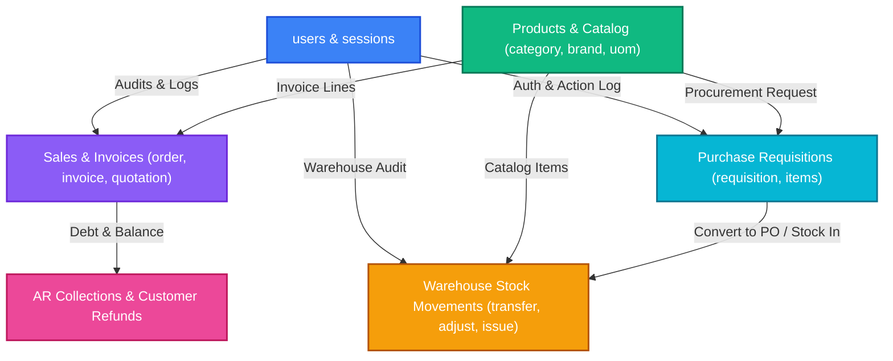

# 🛒 B'Groceries - Enterprise ERP & Supermarket Hub Database Schema

> **Comprehensive Entity-Relationship Model & DBML Guide**  
> Formatted and optimized for direct visualization on [dbdiagram.io](https://dbdiagram.io).

---

## 📌 Table of Contents
1. [Overview & Architecture](#-overview--architecture)
2. [How to Use with dbdiagram.io](#-how-to-use-with-dbdiagramio)
3. [Domain Modules Breakdown](#-domain-modules-breakdown)
   - [1. Authentication & Security (5 Tables)](#1-authentication--security)
   - [2. Information & HR (4 Tables)](#2-information--hr)
   - [3. Stock Catalog & Master Data (14 Tables)](#3-stock-catalog--master-data)
   - [4. Inventory & Stock Operations (10 Tables)](#4-inventory--stock-operations)
   - [5. Sales & Customer Invoicing (15 Tables)](#5-sales--customer-invoicing)
   - [6. AR Collections, Deposits & Refunds (10 Tables)](#6-ar-collections-deposits--refunds)
   - [7. Purchase Management (2 Tables)](#7-purchase-management)
4. [Domain Relationship Graph (Mermaid)](#-domain-relationship-graph)
5. [Complete DBML Code (Copy & Paste to dbdiagram.io)](#-complete-dbml-code)

---

## 🌟 Overview & Architecture

The **B'Groceries** system is powered by a high-throughput **Spring Boot (Java 17/21)** backend linked to a managed **Neon PostgreSQL** cloud relational database. 

The schema includes **60 normalized tables** categorized into **7 major enterprise domains**:
- **Role-Based Access Control & Multi-Provider Auth** (JWT, OAuth2, Telegram Webhooks, OTP)
- **Master Catalog** (Products, Categories, Brands, Scales, Multi-UOM, Barcodes, Suppliers)
- **Warehouse Movements** (Stock Documents, Adjustments, Transfers, Issues, Receipts)
- **Full Sales Pipeline** (Quotations, Sales Orders, POS Invoices, Multi-channel Web Orders)
- **Accounts Receivable & Cash Flow** (Aging Analysis, AR Collections, Customer Deposits, Refunds)
- **Procurement & Purchase Hub** (Internal Stock Requisitions, Line Item Cost Aggregations)

---

## 🚀 How to Use with dbdiagram.io

Follow these simple steps to generate an interactive visual ER diagram:

1. Visit **[https://dbdiagram.io](https://dbdiagram.io)**.
2. Click **"New Diagram"** (or open an existing canvas).
3. Clear the editor panel on the left.
4. Copy the entire contents of the **[Complete DBML Code](#-complete-dbml-code)** section below (or open [`DATABASE_SCHEMA.dbml`](file:///d:/1.B'Groceries/Backend/B-Backend/DATABASE_SCHEMA.dbml)).
5. Paste it into the editor.
6. The interactive visual diagram with all **60 tables, 69 relationships, and 7 TableGroups** will render automatically!
7. *(Optional)* Click **Export** in dbdiagram.io to download as **PDF**, **PNG**, or generate **PostgreSQL DDL**.

---

## 📦 Domain Modules Breakdown

| Domain | Tables Count | Key Tables | Description |
| :--- | :---: | :--- | :--- |
| **Auth & Security** | 5 | `users`, `login_sessions`, `activity_logs`, `otp_codes`, `password_reset_otps` | Authentication, auditing, login sessions, multi-factor verification |
| **Information & HR** | 4 | `job`, `job_application`, `member`, `member_detail` | Careers, recruitment pipelines, company personnel & member directories |
| **Stock Catalog** | 14 | `product`, `category`, `brand`, `unit_of_measure`, `supplier`, `product_scale` | Product master data, barcode lookups, scale integration, pricing histories |
| **Inventory Operations** | 10 | `stock_document`, `adjustment_document`, `transfer_document`, `issue_document` | Physical warehouse stock transfers, audits, damages, receipts, and line items |
| **Sales & Invoices** | 15 | `customer`, `sale_invoice`, `sale_order`, `quotation`, `web_order`, `aging_invoices` | Point-of-sale invoices, customer terms, credit aging, quotations, and web store |
| **AR & Refunds** | 10 | `ar_collections`, `customer_deposits`, `customer_refunds`, `consignments`, `return_invoice` | Accounts receivable settlements, cash deposits, credit refunds, consignments |
| **Purchase Management** | 2 | `requisitions`, `requisition_items` | Internal department stock requests, approval workflows, PO conversions |

---

## 📊 Domain Relationship Graph



---

## 💻 Complete DBML Code

```dbml
// =========================================================================
// B'Groceries ERP & Supermarket Management Hub - Database Schema (DBML)
// Official DBML Documentation: https://dbml.dbdiagram.io/docs
// Ready to copy & paste into https://dbdiagram.io
// Database Target: PostgreSQL / Spring Boot JPA Architecture
// =========================================================================

Table activity_logs {
  id bigint [primary key, increment]
  username varchar [not null]
  user_full_name varchar
  action_type varchar [not null]
  entity_type varchar [not null]
  entity_id bigint
  entity_name varchar
  description varchar [not null]
  icon varchar
  ip_address varchar
  created_at timestamp [not null]
}

Table job {
  id bigint [primary key, increment]
  title varchar [not null]
  department varchar [not null]
  location varchar [not null]
  type varchar [not null]
  salary varchar
  description varchar
  requirements varchar
  benefits varchar
  created_at timestamp [not null]
  updated_at timestamp
}

Table job_application {
  id bigint [primary key, increment]
  job_id bigint [not null]
  full_name varchar [not null]
  email varchar [not null]
  phone varchar [not null]
  linkedin_url varchar
  cover_letter varchar
  resume_name varchar
  resume_data varchar
  resume_content_type varchar
  created_at timestamp [not null]
}

Table member {
  id bigint [primary key, increment]
  member_code varchar [not null, unique]
  full_name varchar [not null]
  position varchar
  rank integer
  department varchar
  category varchar
  photo_url varchar
  member_detail bigint
  created_at timestamp [not null]
  updated_at timestamp
}

Table member_detail {
  id bigint [primary key, increment]
  member bigint [not null, unique]
  phone_number varchar
  email varchar
  address varchar
  date_of_birth date
  gender varchar
  emergency_contact varchar
  start_date date
  note varchar
  nationality varchar
}

Table login_sessions {
  id bigint [primary key, increment]
  token varchar [not null, unique]
  telegram_user_id bigint
  telegram_username varchar
  telegram_first_name varchar
  jwt_token varchar
  expires_at timestamp [not null]
  created_at timestamp [not null]
}

Table otp_codes {
  id bigint [primary key, increment]
  phone_number varchar [not null]
  code_hash varchar [not null]
  purpose varchar [not null]
  expires_at timestamp [not null]
  created_at timestamp [not null]
}

Table password_reset_otps {
  id bigint [primary key, increment]
  email varchar [not null]
  code_hash varchar [not null]
  expires_at timestamp [not null]
  created_at timestamp [not null]
}

Table requisitions {
  id bigint [primary key, increment]
  code varchar [not null, unique]
  date date
  require_date date
  template_name varchar
  requisition_type varchar
  reference varchar
  reference_code varchar
  user_name varchar
  note varchar
  created_at timestamp
  updated_at timestamp
}

Table requisition_items {
  id bigint [primary key, increment]
  requisition_id bigint [not null]
  product_id bigint
  code varchar
  barcode varchar
  description varchar
  uom varchar
}

Table aging_invoices {
  id bigint [primary key, increment]
  code varchar [not null, unique]
  invoice_date date [not null]
  due_date date
  customer varchar [not null]
  contact_name varchar
  phone varchar
  salesperson varchar
  customer_group varchar
  created_at timestamp [not null]
  updated_at timestamp
}

Table ar_collections {
  id bigint [primary key, increment]
  code varchar [not null, unique]
  payment_date timestamp [not null]
  customer_id bigint
  customer varchar [not null]
  contact varchar
  note varchar [not null]
  authorization_note varchar
  created_at timestamp
  updated_at timestamp
}

Table ar_collection_invoices {
  id bigint [primary key, increment]
  ar_collection_id bigint [not null]
  inv_code varchar
  inv_date timestamp
  due_date timestamp
}

Table consignments {
  id bigint [primary key, increment]
  code varchar [not null, unique]
  consignment_date timestamp [not null]
  delivery_date timestamp
  customer_id bigint
  customer_name varchar
  customer_phone varchar
  customer_address varchar
  salesperson varchar
  payment_term varchar
  outlet varchar
  template_name varchar
  reference varchar
  username varchar
  note varchar
  billing_name varchar
  billing_phone varchar
  billing_email varchar
  billing_address varchar
  shipping_recipient varchar
  shipping_phone varchar
  shipping_address varchar
  shipping_courier varchar
  created_at timestamp
  updated_at timestamp
}

Table consignment_items {
  id bigint [primary key, increment]
  consignment_id bigint [not null]
  product_id bigint
  product_code varchar
  barcode varchar
  description varchar [not null]
  note varchar
}

Table customer {
  id bigint [primary key, increment]
  code varchar [unique]
  customer_name varchar [not null]
  second_language varchar
  customer_group varchar
  sale_employee varchar
  tax_no varchar
  payment_term varchar
  terms_and_condition varchar
  price_book varchar
  quote_template varchar
  so_template varchar
  invoice_template varchar
  do_template varchar
  credit_limit numeric(14,2)
  current_balance numeric(14,2)
  credit_deposit numeric(14,2)
  balance numeric(14,2)
  contact_first_name varchar
  contact_last_name varchar
  contact_gender varchar
  contact_dob date
  contact_phone varchar
  contact_mobile varchar
  contact_email varchar
  contact_website varchar
  address_description varchar
  address_second_language varchar
  address_line1 varchar
  address_line2 varchar
  address_city varchar
  address_state varchar
  address_country varchar
  address_phone varchar
  address_phone_ext varchar
  address_fax varchar
  address_fax_ext varchar
  address_email varchar
  address_website varchar
  created_at timestamp [not null]
  updated_at timestamp
}

Table customer_deposits {
  id bigint [primary key, increment]
  code varchar [not null, unique]
  deposit_date timestamp [not null]
  customer_id bigint
  customer_name varchar [not null]
  contact varchar
  reference varchar
  note varchar [not null]
  created_at timestamp
  updated_at timestamp
}

Table customer_group {
  id bigint [primary key, increment]
  code varchar [unique]
  description varchar [not null]
  second_language varchar
  created_at timestamp [not null]
  updated_at timestamp
}

Table customer_refunds {
  id bigint [primary key, increment]
  code varchar [not null, unique]
  payment_date timestamp [not null]
  customer_id bigint
  partner varchar [not null]
  contact varchar
  phone varchar
  note varchar [not null]
  authorization_note varchar
  created_at timestamp
  updated_at timestamp
}

Table customer_refund_invoices {
  id bigint [primary key, increment]
  customer_refund_id bigint [not null]
  code varchar
  date timestamp
}

Table payment_terms {
  id bigint [primary key, increment]
  code varchar [not null, unique]
  description varchar [not null]
  second_language varchar
  note varchar
  created_at timestamp
  updated_at timestamp
}

Table quotation {
  id bigint [primary key, increment]
  code varchar [not null, unique]
  quotation_date timestamp [not null]
  expired_date timestamp
  customer_id bigint
  customer_name varchar
  customer_phone varchar
  customer_address varchar
  salesperson varchar
  payment_term varchar
  outlet varchar
  template_name varchar
  reference varchar
  username varchar
  note varchar
  billing_name varchar
  billing_phone varchar
  billing_email varchar
  billing_address varchar
  billing_city varchar
  billing_tax_no varchar
  shipping_name varchar
  shipping_phone varchar
  shipping_address varchar
  shipping_city varchar
  created_at timestamp
  updated_at timestamp
}

Table quotation_item {
  id bigint [primary key, increment]
  quotation_id bigint [not null]
  product_id bigint
  product_code varchar
  barcode varchar
  description varchar [not null]
  note varchar
}

Table return_invoice {
  id bigint [primary key, increment]
  invoice_code varchar [not null, unique]
  apply_to_invoice varchar
  return_date date [not null]
  customer_id bigint
  customer_name varchar
  customer_phone varchar
  customer_address varchar
  tax_code varchar
  payment_term varchar
  salesperson varchar
  outlet varchar
  user_name varchar
  so_code varchar
  reason varchar [not null]
  created_at timestamp [not null]
  updated_at timestamp
}

Table return_invoice_item {
  id bigint [primary key, increment]
  return_invoice_id bigint [not null]
  product_id bigint
  product_code varchar
  description varchar [not null]
  uom varchar
}

Table return_shipment {
  id bigint [primary key, increment]
  return_ship_code varchar [not null, unique]
  so_code varchar
  date timestamp [not null]
  customer varchar [not null]
  delivery_person varchar
  outlet varchar [not null]
  username varchar
  created_at timestamp
}

Table sale_invoice {
  id bigint [primary key, increment]
  invoice_code varchar [not null, unique]
  invoice_date date [not null]
  due_date date
  so_code varchar
  customer_id bigint
  customer_name varchar
  customer_phone varchar
  customer_address varchar
  salesperson varchar
  payment_term varchar
  outlet varchar
  location varchar
  template_name varchar
  barcode varchar
  username varchar
  note varchar
  payment_type varchar
  billing_name varchar
  billing_phone varchar
  billing_email varchar
  billing_address varchar
  billing_city varchar
  billing_tax_no varchar
  shipping_recipient varchar
  shipping_phone varchar
  shipping_address varchar
  shipping_method varchar
  tracking_no varchar
  created_at timestamp [not null]
  updated_at timestamp
}

Table sale_invoice_item {
  id bigint [primary key, increment]
  sale_invoice_id bigint [not null]
  product_id bigint
  product_code varchar
  description varchar [not null]
  uom varchar
}

Table sale_invoice_payment {
  id bigint [primary key, increment]
  sale_invoice_id bigint [not null]
  payment_date timestamp [not null]
  reference varchar [not null]
  note varchar
  received_by varchar
  created_at timestamp [not null]
}

Table sale_order {
  id bigint [primary key, increment]
  code varchar [not null, unique]
  quote_code varchar
  po_code varchar
  order_date timestamp [not null]
  delivery_date timestamp
  customer_id bigint
  customer_name varchar
  customer_phone varchar
  salesperson varchar
  payment_term varchar
  outlet varchar
  template_name varchar
  reference varchar
  username varchar
  note varchar
  related_purchase_order varchar
  created_at timestamp
  updated_at timestamp
}

Table sale_order_item {
  id bigint [primary key, increment]
  sale_order_id bigint [not null]
  product_id bigint
  product_code varchar
  barcode varchar
  description varchar [not null]
}

Table sale_promotion {
  id bigint [primary key, increment]
  code varchar [not null, unique]
  description varchar [not null]
  second_language varchar
  price_book varchar
  target_scope_id bigint
  target_scope_name varchar
  start_date date [not null]
  end_date date
  created_at timestamp [not null]
  updated_at timestamp
}

Table shipment {
  id bigint [primary key, increment]
  ship_code varchar [not null, unique]
  date timestamp [not null]
  customer varchar [not null]
  phone varchar
  delivery_person varchar
  salesperson varchar [not null]
  reference varchar
  username varchar
  outlet varchar
  carrier varchar
  destination varchar
  created_at timestamp
}

Table web_order {
  id bigint [primary key, increment]
  code varchar [not null, unique]
  order_date timestamp [not null]
  delivery_date timestamp
  salesperson varchar
  customer_name varchar [not null]
  phone varchar
  reference varchar [not null]
  username varchar
  outlet varchar
  channel varchar
  shipping_address varchar
  created_at timestamp
}

Table web_order_item {
  id bigint [primary key, increment]
  web_order_id bigint [not null]
  product_id bigint
  product_code varchar
  description varchar [not null]
}

Table adjustment_document {
  id bigint [primary key, increment]
  code varchar [not null, unique]
  doc_date date [not null]
  adjustment_type varchar
  reference varchar
  adjusted_by varchar
  outlet varchar
  note varchar
  total_diff numeric(14,2)
  total_cost numeric(14,2)
  status varchar [not null]
  created_at timestamp [not null]
  updated_at timestamp
}

Table adjustment_line {
  id bigint [primary key, increment]
  document_id bigint [not null]
  product_id bigint [not null]
  name_snapshot varchar
  counted_qty numeric(14,2) [not null]
  qty_before numeric(14,2)
  qty_diff numeric(14,2)
  unit_cost numeric(14,2)
  uom varchar
}

Table attribute {
  id bigint [primary key, increment]
  code varchar [unique]
  description varchar [not null]
  name_kh varchar
  type varchar
  values_text varchar
  created_at timestamp [not null]
  updated_at timestamp
}

Table attribute_change_log {
  id bigint [primary key, increment]
  product_id bigint [not null]
  attribute_name varchar [not null]
  old_value varchar
  new_value varchar [not null]
  reason varchar
  changed_by varchar
  changed_at timestamp [not null]
  product_name varchar
}

Table brand {
  id bigint [primary key, increment]
  code varchar [unique]
  description varchar [not null]
  name_kh varchar
  created_at timestamp [not null]
  updated_at timestamp
}

Table category {
  id bigint [primary key, increment]
  code varchar [unique]
  description varchar [not null]
  name_kh varchar
  created_at timestamp [not null]
  updated_at timestamp
}

Table cost_change_log {
  id bigint [primary key, increment]
  product_id bigint [not null]
  old_cost numeric(14,2)
  new_cost numeric(14,2)
  adjustment_type varchar
  adjustment_value numeric(14,2)
  reason varchar
  changed_by varchar
  changed_at timestamp [not null]
  product_name varchar
}

Table issue_document {
  id bigint [primary key, increment]
  code varchar [not null, unique]
  doc_date date [not null]
  issue_type varchar
  reference varchar
  issued_by varchar
  outlet varchar
  note varchar
  total_cost numeric(14,2)
  status varchar [not null]
  created_at timestamp [not null]
  updated_at timestamp
}

Table issue_line {
  id bigint [primary key, increment]
  document_id bigint [not null]
  product_id bigint [not null]
  name_snapshot varchar
  qty numeric(14,2) [not null]
  unit_cost numeric(14,2)
  uom varchar
  qty_before numeric(14,2)
  qty_after numeric(14,2)
}

Table price_history {
  id bigint [primary key, increment]
  product_id bigint [not null]
  old_price numeric(14,2)
  new_price numeric(14,2)
  change_type varchar
  markup_percent numeric(14,2)
  reason varchar
  changed_by varchar
  changed_at timestamp [not null]
  product_name varchar
}

Table product {
  id bigint [primary key, increment]
  code varchar [unique]
  bar_code varchar
  name varchar [not null]
  name_kh varchar
  description varchar
  product_group varchar
  category varchar
  on_hand numeric(14,2)
  uom varchar
  base_price numeric(14,2)
  average_cost numeric(14,2)
  standard_cost numeric(14,2)
  create_date date
  country varchar
  supplier varchar
  part_number varchar
  brand varchar
  on_po numeric(14,2)
  on_so numeric(14,2)
  available_stock numeric(14,2)
  serial varchar
  expiry_date date
  tax numeric(14,2)
  image_url varchar
  created_at timestamp [not null]
  updated_at timestamp
}

Table product_group {
  id bigint [primary key, increment]
  code varchar [unique]
  description varchar [not null]
  name_kh varchar
  created_at timestamp [not null]
  updated_at timestamp
}

Table product_scale {
  id bigint [primary key, increment]
  product_id bigint [not null]
  plu_code varchar [unique]
  scale_barcode varchar
  uom varchar
  tare_weight numeric(14,2)
  created_at timestamp [not null]
  updated_at timestamp
}

Table product_supplier_link {
  id bigint [primary key, increment]
  product_id bigint [not null]
  supplier_id bigint [not null]
  vendor_part_number varchar
  contracted_cost numeric(14,2)
  lead_time_days integer
  created_at timestamp [not null]
  updated_at timestamp
}

Table receive_document {
  id bigint [primary key, increment]
  code varchar [not null, unique]
  doc_date date [not null]
  supplier varchar
  receive_type varchar
  reference varchar
  received_by varchar
  location_key varchar
  template varchar
  note_type varchar
  note varchar
  total_cost numeric(14,2)
  status varchar [not null]
  created_at timestamp [not null]
  updated_at timestamp
}

Table receive_line {
  id bigint [primary key, increment]
  document_id bigint [not null]
  product_id bigint [not null]
  name_snapshot varchar
  qty numeric(14,2) [not null]
  unit_cost numeric(14,2)
  uom varchar
  serials varchar
  qty_before numeric(14,2)
  qty_after numeric(14,2)
}

Table serial_number {
  id bigint [primary key, increment]
  product_id bigint [not null]
  stock_line_id bigint
  serial_number varchar [not null]
  batch_lot varchar
  expiry_date date
  product_code varchar
  product_name varchar
  created_at timestamp [not null]
}

Table stock_document {
  id bigint [primary key, increment]
  code varchar [not null, unique]
  doc_type varchar [not null]
  doc_date date [not null]
  supplier varchar
  receive_type varchar
  reference varchar
  received_by varchar
  location_key varchar
  total_cost numeric(14,2)
  note varchar
  status varchar [not null]
  posted_by varchar
  created_at timestamp [not null]
  updated_at timestamp
}

Table stock_line {
  id bigint [primary key, increment]
  document_id bigint [not null]
  product_id bigint [not null]
  name_snapshot varchar
  qty numeric(14,2)
  counted_qty numeric(14,2)
  qty_before numeric(14,2)
  qty_after numeric(14,2)
  unit_cost numeric(14,2)
  line_total numeric(14,2)
  serials varchar
}

Table supplier {
  id bigint [primary key, increment]
  code varchar [unique]
  name varchar [not null]
  name_kh varchar
  supplier_group varchar
  tax_number varchar
  payment_term varchar
  po_template_name varchar
  shipment_method varchar
  purchase_person varchar
  term_condition varchar
  bill_template_name varchar
  debit_deposit_payment_term varchar
  contact_first_name varchar
  contact_last_name varchar
  contact_gender varchar
  contact_phone varchar
  contact_mobile varchar
  contact_email varchar
  contact_website varchar
  address_description varchar
  address_name_kh varchar
  address_line1 varchar
  address_line2 varchar
  address_city varchar
  address_state varchar
  address_country varchar
  address_phone varchar
  address_phone_ext varchar
  address_fax varchar
  address_fax_ext varchar
  address_email varchar
  address_website varchar
  created_at timestamp [not null]
  updated_at timestamp
}

Table supplier_group {
  id bigint [primary key, increment]
  code varchar [unique]
  description varchar [not null]
  name_kh varchar
  created_at timestamp [not null]
  updated_at timestamp
}

Table transfer_document {
  id bigint [primary key, increment]
  code varchar [not null, unique]
  doc_type varchar [not null]
  transfer_date date [not null]
  required_date date
  request_transfer_date date
  from_outlet varchar
  from_location varchar
  to_outlet varchar
  to_location varchar
  transfer_type varchar
  reference varchar
  template_name varchar
  carrier varchar
  tracking_number varchar
  dispatch_note varchar
  status varchar [not null]
  user_name varchar
  total_qty numeric(14,2)
  created_at timestamp [not null]
  updated_at timestamp
}

Table transfer_line {
  id bigint [primary key, increment]
  transfer_document_id bigint [not null]
  product_id bigint
  code varchar
  bar_code varchar
  name varchar
  name_kh varchar
  uom varchar
  on_hand numeric(14,2)
  qty numeric(14,2) [not null]
  unit_cost numeric(14,2)
  line_total numeric(14,2)
}

Table unit_of_measure {
  id bigint [primary key, increment]
  code varchar [unique]
  description varchar [not null]
  name_kh varchar
  factor double precision
  created_at timestamp [not null]
  updated_at timestamp
}

Table users {
  id bigint [primary key, increment]
  full_name varchar [not null]
  username varchar [unique]
  email varchar [unique]
  telegram varchar [unique]
  facebook varchar [unique]
  google_id varchar [unique]
  facebook_id varchar [unique]
  telegram_id varchar [unique]
  telegram_user_id bigint [unique]
  login_provider varchar
  phone_number varchar [unique]
  date_of_birth date
  gender varchar
  nationality varchar
  password_hash varchar [not null]
  created_at timestamp [not null]
  updated_at timestamp
}

// =========================================================================
// RELATIONSHIPS & FOREIGN KEYS
// =========================================================================

Ref: job_application.job_id > job.id // many-to-one
Ref: requisition_items.requisition_id > requisitions.id // many-to-one
Ref: ar_collection_invoices.ar_collection_id > ar_collections.id // many-to-one
Ref: consignment_items.consignment_id > consignments.id // many-to-one
Ref: customer_refund_invoices.customer_refund_id > customer_refunds.id // many-to-one
Ref: quotation_item.quotation_id > quotation.id // many-to-one
Ref: return_invoice_item.return_invoice_id > return_invoice.id // many-to-one
Ref: sale_invoice_item.sale_invoice_id > sale_invoice.id // many-to-one
Ref: sale_invoice_payment.sale_invoice_id > sale_invoice.id // many-to-one
Ref: sale_order_item.sale_order_id > sale_order.id // many-to-one
Ref: web_order_item.web_order_id > web_order.id // many-to-one
Ref: adjustment_line.document_id > adjustment_document.id // many-to-one
Ref: adjustment_line.product_id > product.id // many-to-one
Ref: attribute_change_log.product_id > product.id // many-to-one
Ref: cost_change_log.product_id > product.id // many-to-one
Ref: issue_line.document_id > issue_document.id // many-to-one
Ref: issue_line.product_id > product.id // many-to-one
Ref: price_history.product_id > product.id // many-to-one
Ref: product_scale.product_id > product.id // many-to-one
Ref: product_supplier_link.product_id > product.id // many-to-one
Ref: product_supplier_link.supplier_id > supplier.id // many-to-one
Ref: receive_line.document_id > receive_document.id // many-to-one
Ref: receive_line.product_id > product.id // many-to-one
Ref: serial_number.product_id > product.id // many-to-one
Ref: serial_number.stock_line_id > stock_line.id // many-to-one
Ref: stock_line.document_id > stock_document.id // many-to-one
Ref: stock_line.product_id > product.id // many-to-one
Ref: transfer_line.transfer_document_id > transfer_document.id // many-to-one
Ref: transfer_line.product_id > product.id // many-to-one
Ref: member_detail.member > member.id
Ref: job_application.job_id > job.id
Ref: product_supplier_link.product_id > product.id
Ref: product_supplier_link.supplier_id > supplier.id
Ref: price_history.product_id > product.id
Ref: cost_change_log.product_id > product.id
Ref: serial_number.product_id > product.id
Ref: serial_number.stock_line_id > stock_line.id
Ref: product_scale.product_id > product.id
Ref: stock_line.document_id > stock_document.id
Ref: stock_line.product_id > product.id
Ref: adjustment_line.document_id > adjustment_document.id
Ref: adjustment_line.product_id > product.id
Ref: issue_line.document_id > issue_document.id
Ref: issue_line.product_id > product.id
Ref: receive_line.document_id > receive_document.id
Ref: receive_line.product_id > product.id
Ref: transfer_line.transfer_document_id > transfer_document.id
Ref: transfer_line.product_id > product.id
Ref: quotation_item.quotation_id > quotation.id
Ref: quotation_item.product_id > product.id
Ref: sale_order_item.sale_order_id > sale_order.id
Ref: sale_order_item.product_id > product.id
Ref: sale_invoice_item.sale_invoice_id > sale_invoice.id
Ref: sale_invoice_item.product_id > product.id
Ref: sale_invoice_payment.sale_invoice_id > sale_invoice.id
Ref: web_order_item.web_order_id > web_order.id
Ref: web_order_item.product_id > product.id
Ref: consignments.customer_id > customer.id
Ref: consignment_items.consignment_id > consignments.id
Ref: consignment_items.product_id > product.id
Ref: return_invoice_item.return_invoice_id > return_invoice.id
Ref: return_invoice_item.product_id > product.id
Ref: ar_collections.customer_id > customer.id
Ref: ar_collection_invoices.ar_collection_id > ar_collections.id
Ref: customer_deposits.customer_id > customer.id
Ref: customer_refunds.customer_id > customer.id
Ref: customer_refund_invoices.customer_refund_id > customer_refunds.id
Ref: requisition_items.requisition_id > requisitions.id
Ref: requisition_items.product_id > product.id

// =========================================================================
// TABLE GROUPS FOR DBDATABASE.IO CANVAS
// =========================================================================

TableGroup Auth_And_Security {
  activity_logs
  login_sessions
  otp_codes
  password_reset_otps
  users
}

TableGroup Information_And_HR {
  job
  job_application
  member
  member_detail
}

TableGroup Purchase_Management {
  requisitions
  requisition_items
}

TableGroup Sales_And_Invoices {
  aging_invoices
  customer
  customer_group
  payment_terms
  quotation
  quotation_item
  sale_invoice
  sale_invoice_item
  sale_invoice_payment
  sale_order
  sale_order_item
  sale_promotion
  shipment
  web_order
  web_order_item
}

TableGroup AR_Collections_And_Refunds {
  ar_collections
  ar_collection_invoices
  consignments
  consignment_items
  customer_deposits
  customer_refunds
  customer_refund_invoices
  return_invoice
  return_invoice_item
  return_shipment
}

TableGroup Inventory_Operations {
  adjustment_document
  adjustment_line
  issue_document
  issue_line
  receive_document
  receive_line
  stock_document
  stock_line
  transfer_document
  transfer_line
}

TableGroup Stock_Catalog {
  attribute
  attribute_change_log
  brand
  category
  cost_change_log
  price_history
  product
  product_group
  product_scale
  product_supplier_link
  serial_number
  supplier
  supplier_group
  unit_of_measure
}

// =========================================================================
// SAMPLE RECORDS (FOR DBDATABASE.IO MOCK PREVIEWS)
// =========================================================================

Records users(id, username, email, role, enabled) {
  1, 'Badmin', 'admin@bgroceries.com', 'ADMIN', true
  2, 'ManagerJohn', 'john@bgroceries.com', 'MANAGER', true
  3, 'CashierDara', 'dara@bgroceries.com', 'CASHIER', true
}

Records category(id, name, code) {
  1, 'Beverages', 'CAT-BEV'
  2, 'Snacks & Confectionery', 'CAT-SNK'
  3, 'Dairy & Eggs', 'CAT-DAI'
  4, 'Grains & Rice', 'CAT-GRN'
}

Records brand(id, name, code) {
  1, 'Coca Cola Company', 'BRD-CC'
  2, 'Frito Lay', 'BRD-FL'
  3, 'Anchor', 'BRD-ANC'
}

Records customer(id, code, name, phone, email, status) {
  1, 'CUST-001', 'Angkor Supermart', '+855 12 888 999', 'orders@angkorsmart.com', 'ACTIVE'
  2, 'CUST-002', 'Lucky Mart Tuol Kork', '+855 23 777 666', 'procurement@luckymart.kh', 'ACTIVE'
}

Records requisitions(id, code, date, require_date, requisition_type, requisition_amount, user_name, status) {
  1, 'REQ-20260904-0001', '2026-09-04', '2026-09-11', 'Store Replenishment', 1450.00, 'Badmin', 'OPEN'
  2, 'REQ-20260904-0002', '2026-09-04', '2026-09-12', 'Urgent Restock', 820.50, 'ManagerJohn', 'COMPLETED'
}

Records requisition_items(id, requisition_id, code, barcode, description, requisition_qty, uom, cost, total) {
  1, 1, 'BEV-CC-001', '8850123000124', 'Coca Cola 330ml Can', 100, 'Can', 0.45, 45.00
  2, 1, 'SNK-PO-002', '8850123000230', 'Lays Classic 50g', 200, 'Pcs', 1.10, 220.00
}
```

---
*Created for B'Groceries Supermarket ERP system. Ready for integration with dbdiagram.io.*
